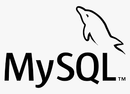

## Hello World! 👋

**My name is Flavianny Maciel Mussi from Brazil!**
I've been a software development student at Trybe since March 2020.

### Technologies:

   
   
  
  
  
   
  
  
  
  
    

### About Me

:airplane: I love traveling | :rocket: I love teach and learn :books: | I like to watch :movie_camera: documentaries, :tv: series and :notes: hear music

:cat: Cat lover | :libra: Libran | :mag: Available for freelance projects/internship opportunities!

-----

